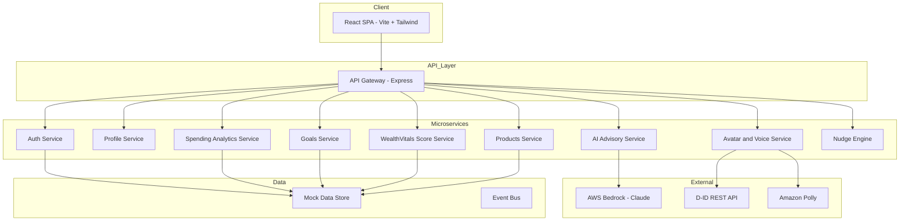
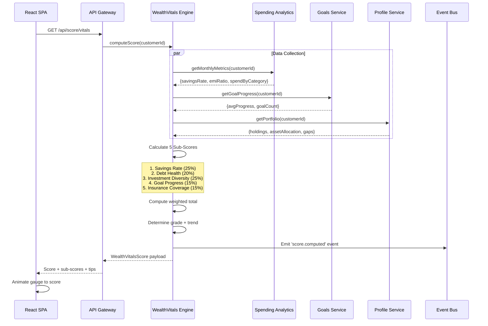
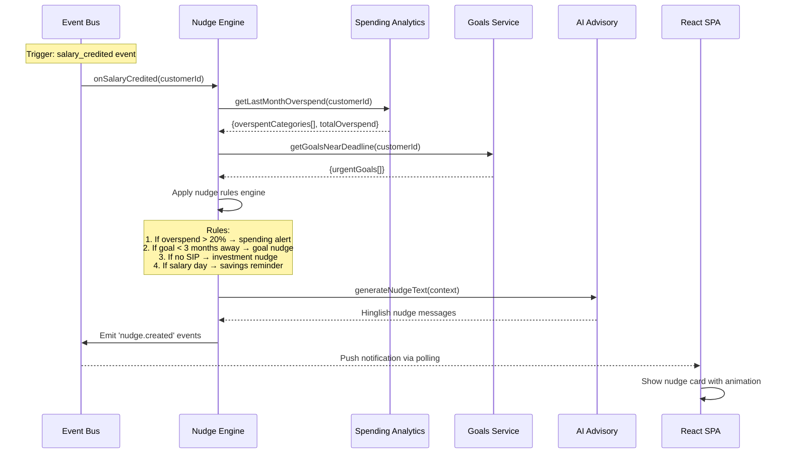
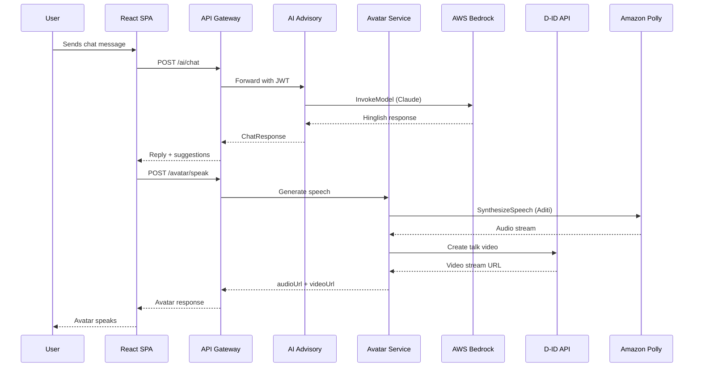

# Design Document: WealthSeva AI

## Overview

WealthSeva AI is a full-stack, avatar-driven, vernacular-first digital wealth advisory platform designed for IDBI Bank as a hackathon demo. The platform leverages AWS Bedrock (Claude) for AI-powered financial advice delivered in Hinglish, D-ID streaming avatars for conversational engagement, and Amazon Polly for voice synthesis in Hindi (Aditi voice).

The system follows a microservices architecture to ensure independent scalability, fault isolation, and clear separation of concerns. Each domain — user management, AI advisory, spending analytics, goal planning, product recommendations, and avatar/voice — is encapsulated in its own service communicating via REST APIs and an event bus for asynchronous operations.

The frontend is a React SPA (Vite + Tailwind CSS) that orchestrates these microservices through an API Gateway, providing a responsive mobile-first experience with Indian localization (₹ formatting, Devanagari typography, Hinglish content).

**Tech Stack**: React (Vite) + Tailwind CSS | Node.js + Express | AWS Bedrock (Claude claude-sonnet-4-6) | D-ID Streaming API | Amazon Polly (Aditi/hi-IN) | Recharts | In-memory JSON data store

## Architecture

### System Architecture



#### Flow 2: WealthVitals Score Computation



#### Flow 3: Proactive Nudge Generation



### Request Flow



## Components and Interfaces

### Component 1: API Gateway

**Purpose**: Single entry point for all client requests. Handles routing, JWT validation, rate limiting, and CORS.

**Interface**:
```typescript
interface APIGatewayConfig {
  port: number;
  services: ServiceRegistration[];
  rateLimitPerMinute: number;
  corsOrigins: string[];
}

interface ServiceRegistration {
  name: string;
  prefix: string;
  targetPort: number;
  healthCheckPath: string;
}
```

**Responsibilities**:
- Route requests to appropriate microservice
- Validate JWT tokens on protected routes
- Apply rate limiting on AI/Avatar endpoints
- Handle CORS for frontend origin

---

## Components and Interfaces

### Component 1: API Gateway (Express Router)

**Purpose**: Single entry point for all client requests. Handles routing, JWT authentication, rate limiting, CORS, and request logging.

**Interface**:
```typescript
interface APIGatewayConfig {
  port: number;                    // Default: 3001
  jwtSecret: string;
  rateLimits: {
    general: number;               // 100 req/min
    ai: number;                    // 20 req/min (Bedrock cost control)
    avatar: number;                // 10 req/min (D-ID rate limits)
  };
  corsOrigins: string[];
  services: ServiceRoute[];
}

interface ServiceRoute {
  prefix: string;                  // e.g., '/api/chat'
  handler: express.Router;
  middleware?: express.RequestHandler[];
  rateLimit?: number;
}

// Middleware chain
type MiddlewareStack = [
  cors(),
  helmet(),
  rateLimit(),
  jwtAuth(),                       // Skip for /api/auth/*
  requestLogger(),
  errorHandler()
];
```

**Responsibilities**:
- Route all `/api/*` requests to appropriate service handlers
- Validate JWT on all protected routes (exclude `/api/auth/login`)
- Apply tiered rate limiting (stricter on AI/Avatar endpoints)
- CORS configuration for frontend origin
- Request/response logging for demo debugging
- Global error handling with user-friendly Hinglish messages

---

### Component 2: Auth Service

**Purpose**: Mock authentication for hackathon demo. Issues JWT tokens with customer context.

**Interface**:
```typescript
interface AuthService {
  login(credentials: LoginRequest): Promise<AuthResponse>;
  validateToken(token: string): TokenPayload | null;
  refreshToken(token: string): Promise<AuthResponse>;
}

interface LoginRequest {
  customerId: string;              // e.g., 'IDBI001'
  pin: string;                     // 4-digit mock PIN '1234'
}

interface AuthResponse {
  success: boolean;
  token: string;                   // JWT (HS256, 24h expiry)
  customer: CustomerSummary;
  message: string;                 // Hinglish welcome message
}

interface CustomerSummary {
  id: string;
  name: string;
  archetype: string;
  wealthVitalsScore: number;
  preferredLanguage: 'hinglish';
}

interface TokenPayload {
  customerId: string;
  name: string;
  archetype: string;
  iat: number;
  exp: number;
}
```

**Endpoint**: `POST /api/auth/login`

---

### Component 2: Auth Service

**Purpose**: Mock authentication for demo. Issues JWT tokens and manages sessions.

**Interface**:
```typescript
interface AuthService {
  login(credentials: LoginRequest): Promise<AuthResponse>;
  validateToken(token: string): Promise<TokenPayload | null>;
}

interface LoginRequest {
  customerId: string;
  pin: string;
}

interface AuthResponse {
  token: string;
  expiresIn: number;
  customer: CustomerSummary;
}

interface TokenPayload {
  customerId: string;
  name: string;
  archetype: string;
  iat: number;
  exp: number;
}
```

**Responsibilities**:
- Validate mock credentials against in-memory store
- Issue signed JWT tokens (HS256, 24h expiry)
- Token validation for gateway middleware

### Component 3: AI Advisory Service

**Purpose**: Core intelligence engine. Orchestrates conversations with AWS Bedrock, maintains context, generates personalized Hinglish advice and proactive nudges.

**Interface**:
```typescript
interface AIAdvisoryService {
  chat(request: ChatRequest): Promise<ChatResponse>;
  generateNudge(context: CustomerContext): Promise<Nudge>;
}

interface ChatRequest {
  customerId: string;
  message: string;
  conversationHistory: ConversationTurn[];
  context: CustomerContext;
}

interface ChatResponse {
  reply: string;
  suggestions: string[];
  nudges: Nudge[];
  intent: QueryIntent;
  confidence: number;
}

interface CustomerContext {
  profile: CustomerProfile;
  recentTransactions: Transaction[];
  goals: Goal[];
  wealthVitalsScore: number;
  portfolio: PortfolioSummary;
}

interface ConversationTurn {
  role: 'user' | 'assistant';
  content: string;
  timestamp: number;
}

interface Nudge {
  id: string;
  type: 'saving' | 'investment' | 'insurance' | 'goal';
  title: string;
  description: string;
  priority: 'high' | 'medium' | 'low';
  actionUrl: string;
}
```

**Responsibilities**:
- Construct system prompt with customer context
- Invoke AWS Bedrock with conversation history
- Parse and structure AI responses
- Generate proactive nudges from spending patterns
- Maintain per-session conversation memory

### Component 3: AI Advisory Engine (Core Intelligence)

**Purpose**: The brain of WealthSeva. Orchestrates AWS Bedrock (Claude claude-sonnet-4-6) conversations with rich customer context, generates Hinglish responses, extracts intents, and produces actionable suggestions.

**Interface**:
```typescript
interface AIAdvisoryEngine {
  chat(request: ChatRequest): Promise<ChatResponse>;
  generateNudgeText(context: NudgeContext): Promise<string>;
  classifyIntent(message: string): Promise<QueryIntent>;
  buildSystemPrompt(context: CustomerContext): string;
}

interface ChatRequest {
  customerId: string;
  message: string;                 // User's Hinglish/Hindi/English input
  conversationHistory: ConversationTurn[];
  includeContext: boolean;         // Whether to inject full financial context
}

interface ChatResponse {
  reply: string;                   // Hinglish AI response
  suggestions: QuickPrompt[];     // 3-4 follow-up chips
  nudges: Nudge[];                // Any triggered proactive nudges
  intent: QueryIntent;
  metadata: {
    tokensUsed: number;
    responseTimeMs: number;
    model: string;
    contextWindowUsed: number;
  };
}

interface QuickPrompt {
  text: string;                    // Display text (Hinglish)
  intent: string;                  // What it triggers
  icon: string;                    // Emoji/icon
}

interface QueryIntent {
  category: 'portfolio' | 'spending' | 'goals' | 'products' | 'general' | 'greeting';
  confidence: number;              // 0-1
  entities: Record<string, string>; // Extracted entities
}

interface ConversationTurn {
  role: 'user' | 'assistant' | 'system';
  content: string;
  timestamp: number;
}

// AWS Bedrock Integration
interface BedrockConfig {
  region: string;                  // 'us-east-1'
  modelId: string;                 // 'anthropic.claude-sonnet-4-6-20250514-v1:0'
  maxTokens: number;              // 1024
  temperature: number;            // 0.7
  topP: number;                   // 0.9
}
```

**System Prompt Strategy**:
```typescript
const SYSTEM_PROMPT_TEMPLATE = `
You are WealthSeva AI — IDBI Bank ka trusted financial advisor.
You ALWAYS respond in Hinglish (Hindi-English mix).
You are warm, friendly, and use Indian cultural references.

Customer Profile:
- Name: {name}, Age: {age}, City: {city}
- Monthly Salary: ₹{salary} | Archetype: {archetype}
- WealthVitals Score: {score}/100 ({grade})
- Risk Profile: {riskProfile}

Portfolio Summary:
{portfolioSummary}

Recent Spending Pattern:
{spendingPattern}

Active Goals:
{goalsSummary}

RULES:
1. ALWAYS use ₹ symbol with Indian number format (₹X,XX,XXX)
2. Mix Hindi and English naturally (60% Hindi, 40% English)
3. Use relatable Indian examples (chai, auto, Diwali shopping)
4. Be encouraging but honest about financial gaps
5. Suggest IDBI Bank products when relevant
6. Keep responses concise (max 3-4 sentences for quick queries)
7. For complex topics, use bullet points
8. Always end with an actionable next step
`;
```

**Endpoints**:
- `POST /api/chat` — Main conversation endpoint
- `POST /api/chat/suggest` — Get quick prompt suggestions

---

### Component 4: Avatar & Voice Service

**Purpose**: Orchestrates D-ID avatar video generation and Amazon Polly speech synthesis for talking avatar responses.

**Interface**:
```typescript
interface AvatarVoiceService {
  speak(request: SpeakRequest): Promise<SpeakResponse>;
  getStatus(): Promise<AvatarStatus>;
}

interface SpeakRequest {
  text: string;
  voiceId?: string;
  languageCode?: string;
  avatarId?: string;
}

interface SpeakResponse {
  audioUrl: string;
  videoUrl: string;
  duration: number;
  fallback: boolean;
}

interface AvatarStatus {
  didApiAvailable: boolean;
  pollyAvailable: boolean;
  fallbackMode: boolean;
}
```

**Responsibilities**:
- Convert text to speech via Amazon Polly (Aditi, hi-IN)
- Submit audio to D-ID for avatar video generation
- Provide CSS animation fallback when D-ID is unavailable
- Cache frequently spoken phrases

### Component 5: Spending Analytics Service

**Purpose**: Analyzes transaction data for spending insights, category breakdowns, trends, and behavioral archetype classification.

**Interface**:
```typescript
interface SpendingAnalyticsService {
  getCategoryBreakdown(customerId: string, months: number): Promise<CategoryBreakdown>;
  getTrends(customerId: string): Promise<SpendingTrend[]>;
  getInsights(customerId: string): Promise<InsightCard[]>;
  classifyArchetype(customerId: string): Promise<BehavioralArchetype>;
}

interface CategoryBreakdown {
  categories: CategorySlice[];
  totalSpend: number;
  period: { from: string; to: string };
}

interface CategorySlice {
  name: string;
  amount: number;
  percentage: number;
  trend: 'up' | 'down' | 'stable';
  monthOverMonth: number;
}

interface InsightCard {
  id: string;
  type: 'alert' | 'tip' | 'achievement';
  title: string;
  description: string;
  amount?: number;
}

interface BehavioralArchetype {
  name: string;
  description: string;
  traits: string[];
  recommendations: string[];
}
```

**Responsibilities**:
- Aggregate transactions by category and time period
- Compute month-over-month spending trends
- Generate actionable insight cards in Hinglish
- Classify customer into behavioral archetype
- Identify anomalies and overspending alerts

### Component 6: Goals Service

**Purpose**: Manages financial goals, tracks progress, calculates SIP requirements, and projects timelines.

**Interface**:
```typescript
interface GoalsService {
  getGoals(customerId: string): Promise<Goal[]>;
  createGoal(customerId: string, goal: CreateGoalRequest): Promise<Goal>;
  calculateSIP(params: SIPCalculation): Promise<SIPResult>;
}

interface Goal {
  id: string;
  name: string;
  targetAmount: number;
  currentAmount: number;
  deadline: string;
  monthlySIP: number;
  progressPercentage: number;
  status: 'on_track' | 'behind' | 'ahead' | 'completed';
  category: 'emergency' | 'education' | 'retirement' | 'home' | 'vehicle' | 'vacation';
}

interface SIPCalculation {
  targetAmount: number;
  currentSavings: number;
  timelineMonths: number;
  expectedReturnRate: number;
}

interface SIPResult {
  monthlySIP: number;
  totalInvestment: number;
  expectedReturns: number;
  projectedValue: number;
  breakdownByYear: YearProjection[];
}
```

**Responsibilities**:
- CRUD operations for financial goals
- SIP calculation with compound interest projections
- Progress tracking against target timelines
- Goal status classification (on-track, behind, ahead)

### Component 7: Products Recommendation Service

**Purpose**: Generates personalized IDBI product recommendations based on customer profile, portfolio gaps, and goals.

**Interface**:
```typescript
interface ProductsService {
  getRecommendations(customerId: string): Promise<ProductRecommendation[]>;
  getProductDetails(productId: string): Promise<ProductDetail>;
}

interface ProductRecommendation {
  product: ProductDetail;
  priority: 'high' | 'medium' | 'low';
  reason: string;
  matchScore: number;
  portfolioGap: string;
}

interface ProductDetail {
  id: string;
  name: string;
  category: 'mutual_fund' | 'insurance' | 'fd' | 'ppf' | 'nps' | 'loan';
  description: string;
  features: string[];
  minInvestment: number;
  expectedReturns?: string;
  idbiExclusive: boolean;
}
```

**Responsibilities**:
- Analyze portfolio gaps (missing MFs, Insurance, PPF)
- Score products against customer profile and risk tolerance
- Generate Hinglish explanations for recommendations
- Prioritize by urgency and lifecycle stage

### Component 4: Avatar & Voice Service

**Purpose**: Orchestrates the talking avatar experience — converts AI text responses to spoken Hindi via Amazon Polly (Aditi voice), then generates lip-synced avatar video via D-ID. Includes CSS animation fallback for reliability.

**Interface**:
```typescript
interface AvatarVoiceService {
  speak(request: SpeakRequest): Promise<SpeakResponse>;
  getStatus(): AvatarStatus;
  warmup(): Promise<void>;         // Pre-initialize D-ID stream
}

interface SpeakRequest {
  text: string;                    // Hindi/Hinglish text to speak
  voiceId: 'Aditi';               // Amazon Polly Hindi voice
  languageCode: 'hi-IN';
  engine: 'neural' | 'standard';  // Prefer 'neural' for quality
  avatarPresenterUrl?: string;    // D-ID presenter image URL
}

interface SpeakResponse {
  audioUrl: string;                // Polly-generated MP3 URL
  videoUrl: string | null;         // D-ID video URL (null if fallback)
  duration: number;                // Audio duration in seconds
  fallbackMode: boolean;           // True = CSS lip-sync animation
  expiresAt: string;               // URL expiry timestamp
}

interface AvatarStatus {
  didApiAvailable: boolean;
  didCreditsRemaining: number;
  pollyAvailable: boolean;
  currentMode: 'streaming' | 'fallback';
  latencyMs: number;
}

// D-ID API Integration
interface DIDCreateTalkRequest {
  source_url: string;              // Presenter image URL
  script: {
    type: 'audio';
    audio_url: string;             // Polly audio URL
  };
  config: {
    stitch: boolean;
    result_format: 'mp4';
  };
}

// Fallback: CSS Animation Config
interface FallbackAvatarConfig {
  idleAnimation: 'breathing';      // Subtle idle movement
  speakingAnimation: 'lip-sync';   // CSS keyframe mouth movement
  audioSync: boolean;              // Sync animation to audio duration
  avatarImage: string;             // Static avatar image path
}
```

**Avatar Fallback Strategy**:
1. **Primary**: D-ID streaming API (full lip-sync video)
2. **Fallback Level 1**: Polly audio + CSS mouth animation on static image
3. **Fallback Level 2**: Text-only with typing animation (if Polly fails)

**Endpoints**:
- `POST /api/avatar/speak` — Generate speech + avatar video
- `GET /api/avatar/status` — Check service availability

---

### Component 5: Behavioral Intelligence & Spending Analytics

**Purpose**: The behavioral brain. Analyzes transaction patterns to classify customers into archetypes, generate spending insights, detect anomalies, and produce culturally-relevant insight cards.

**Interface**:
```typescript
interface BehavioralIntelligenceService {
  classifyArchetype(customerId: string): BehavioralArchetype;
  getCategoryBreakdown(customerId: string, months?: number): CategoryBreakdown;
  getTrends(customerId: string): SpendingTrend[];
  getInsightCards(customerId: string): InsightCard[];
  detectAnomalies(customerId: string): SpendingAnomaly[];
}

// Behavioral Archetypes — Indian customer personas
interface BehavioralArchetype {
  id: string;
  name: string;                    // e.g., 'Family Builder'
  emoji: string;                   // 🏠
  description: string;            // Hinglish description
  traits: ArchetypeTrait[];
  investmentStyle: string;
  riskTolerance: 'low' | 'medium' | 'high';
  idealProducts: string[];
  color: string;                   // Theme color for UI
}

type ArchetypeId = 
  | 'family_builder'              // Family-focused, education priority
  | 'young_hustler'               // Career-focused, growth investor
  | 'conservative_saver'          // Risk-averse, FD-heavy
  | 'lifestyle_spender'           // High discretionary spend
  | 'retirement_planner'          // Long-term focused
  | 'new_earner';                 // First job, building habits

interface ArchetypeTrait {
  label: string;
  value: number;                   // 0-100
  benchmark: number;               // Peer comparison
}

interface CategoryBreakdown {
  categories: CategorySlice[];
  totalSpend: number;
  totalIncome: number;
  savingsRate: number;             // Percentage
  period: { from: string; to: string };
  comparisonWithPeers: PeerComparison;
}

interface CategorySlice {
  name: string;
  nameHindi: string;              // Hindi label
  amount: number;
  percentage: number;
  trend: 'up' | 'down' | 'stable';
  monthOverMonth: number;         // % change
  icon: string;
  color: string;                  // Chart color
}

interface InsightCard {
  id: string;
  type: 'alert' | 'tip' | 'achievement' | 'nudge';
  severity: 'info' | 'warning' | 'success' | 'urgent';
  title: string;                   // Hinglish
  description: string;            // Hinglish
  amount?: number;
  actionLabel?: string;
  actionRoute?: string;
  icon: string;
  timestamp: string;
}

interface SpendingAnomaly {
  category: string;
  currentMonth: number;
  averageMonth: number;
  deviationPercent: number;
  severity: 'minor' | 'moderate' | 'significant';
  message: string;                // Hinglish alert
}
```

**Endpoints**:
- `GET /api/spending/breakdown?months=6` — Category breakdown
- `GET /api/spending/trends` — Monthly trends
- `GET /api/spending/insights` — Insight cards
- `GET /api/spending/archetype` — Behavioral archetype

---

### Component 8: WealthVitals Score Service

**Purpose**: Computes the composite WealthVitals Score (0-100) from 5 sub-scores reflecting overall financial health.

**Interface**:
```typescript
interface WealthVitalsService {
  computeScore(customerId: string): Promise<WealthVitalsScore>;
  getSubScoreDetails(customerId: string): Promise<SubScoreDetail[]>;
}

interface WealthVitalsScore {
  totalScore: number;
  grade: 'A' | 'B' | 'C' | 'D' | 'F';
  subScores: SubScore[];
  trend: 'improving' | 'declining' | 'stable';
  lastUpdated: string;
}

interface SubScore {
  name: SubScoreName;
  score: number;
  weight: number;
  status: 'good' | 'fair' | 'poor';
  improvementTip: string;
}

type SubScoreName =
  | 'savings_rate'
  | 'debt_health'
  | 'investment_diversity'
  | 'goal_progress'
  | 'insurance_coverage';
```

**Responsibilities**:
- Compute 5 sub-scores from customer data
- Apply weighted formula for total score
- Classify into grades (A=80-100, B=60-79, C=40-59, D=20-39, F=0-19)
- Detect trend direction over time
- Generate per-score improvement tips in Hinglish

## Data Models

### Customer Profile

```typescript
interface CustomerProfile {
  id: string;
  name: string;
  age: number;
  city: string;
  monthlySalary: number;
  familySize: number;
  archetype: string;
  preferredLanguage: 'hi' | 'en' | 'hinglish';
  riskProfile: 'conservative' | 'moderate' | 'aggressive';
  onboardingDate: string;
}
```

### Transaction

```typescript
interface Transaction {
  id: string;
  date: string;
  amount: number;
  type: 'debit' | 'credit';
  category: TransactionCategory;
  description: string;
  merchant?: string;
  isRecurring: boolean;
}

type TransactionCategory =
  | 'salary' | 'food_dining' | 'groceries' | 'rent'
  | 'emi' | 'utilities' | 'shopping' | 'entertainment'
  | 'healthcare' | 'education' | 'transport' | 'investment'
  | 'insurance' | 'transfer' | 'other';
```

### Portfolio Summary

```typescript
interface PortfolioSummary {
  totalValue: number;
  holdings: Holding[];
  assetAllocation: AssetAllocation;
  gaps: PortfolioGap[];
}

interface Holding {
  name: string;
  type: 'rd' | 'fd' | 'mf' | 'ppf' | 'nps' | 'insurance' | 'equity';
  value: number;
  returns: number;
  maturityDate?: string;
  taxSaving: boolean;
}

interface AssetAllocation {
  fixedIncome: number;
  equity: number;
  gold: number;
  insurance: number;
  cash: number;
}

interface PortfolioGap {
  assetClass: string;
  severity: 'critical' | 'moderate' | 'minor';
  recommendation: string;
}
```

## Key Functions with Formal Specifications

### computeWealthVitals()

```typescript
function computeWealthVitals(
  customer: CustomerProfile,
  transactions: Transaction[],
  portfolio: PortfolioSummary,
  goals: Goal[]
): WealthVitalsScore
```

**Preconditions:**
- `customer` is non-null with `monthlySalary > 0`
- `transactions` contains at least 1 month of data
- `portfolio` is non-null (may have empty holdings)

**Postconditions:**
- `totalScore` in range [0, 100]
- All `subScores[].score` in range [0, 100]
- Sum of all `subScores[].weight` equals 1.0
- `grade` maps correctly: A(80-100), B(60-79), C(40-59), D(20-39), F(0-19)

**Algorithm:**

```typescript
function computeWealthVitals(
  customer: CustomerProfile,
  transactions: Transaction[],
  portfolio: PortfolioSummary,
  goals: Goal[]
): WealthVitalsScore {
  const monthlyIncome = customer.monthlySalary;
  const monthlyExpenses = sumDebitTransactions(transactions, lastNMonths(1));
  const savingsRate = Math.max(0, (monthlyIncome - monthlyExpenses) / monthlyIncome);
  const savingsScore = Math.min(100, savingsRate * 200);

  const emiTotal = sumByCategory(transactions, 'emi', lastNMonths(1));
  const emiRatio = emiTotal / monthlyIncome;
  const debtScore = emiRatio <= 0.3 ? 100 : emiRatio <= 0.5 ? 60 : 20;

  const assetClasses = countDistinctAssetClasses(portfolio.holdings);
  const diversityScore = Math.min(100, (assetClasses / 5) * 100);

  const avgGoalProgress = goals.length > 0
    ? goals.reduce((sum, g) => sum + g.progressPercentage, 0) / goals.length
    : 0;
  const goalScore = Math.min(100, avgGoalProgress);

  const hasLifeIns = portfolio.holdings.some(h => h.type === 'insurance');
  const hasHealthIns = checkHealthInsurance(customer);
  const insuranceScore = (hasLifeIns ? 50 : 0) + (hasHealthIns ? 50 : 0);

  const weights = [0.25, 0.20, 0.25, 0.15, 0.15];
  const scores = [savingsScore, debtScore, diversityScore, goalScore, insuranceScore];
  const totalScore = Math.round(
    scores.reduce((sum, score, i) => sum + score * weights[i], 0)
  );

  return {
    totalScore,
    grade: scoreToGrade(totalScore),
    subScores: buildSubScores(scores, weights),
    trend: computeTrend(customer.id),
    lastUpdated: new Date().toISOString()
  };
}
```

### Component 6: WealthVitals Score Engine

**Purpose**: Computes the proprietary WealthVitals Score (0-100) — a gamified composite financial health metric with 5 weighted sub-dimensions. This is a key hackathon differentiator.

**Interface**:
```typescript
interface WealthVitalsEngine {
  computeScore(customerId: string): WealthVitalsScore;
  getSubScoreBreakdown(customerId: string): SubScoreDetail[];
  getScoreHistory(customerId: string): ScoreHistoryPoint[];
  getImprovementPlan(customerId: string): ImprovementAction[];
}

interface WealthVitalsScore {
  totalScore: number;              // 0-100
  grade: ScoreGrade;
  label: string;                   // Hinglish label
  subScores: SubScore[];
  trend: 'improving' | 'declining' | 'stable';
  percentileRank: number;         // vs peer group
  lastUpdated: string;
  nextMilestone: {
    score: number;
    label: string;
    stepsNeeded: string[];
  };
}

type ScoreGrade = 'A+' | 'A' | 'B+' | 'B' | 'C' | 'D' | 'F';

interface SubScore {
  id: SubScoreDimension;
  name: string;
  nameHindi: string;
  score: number;                   // 0-100
  weight: number;                  // Sums to 1.0
  status: 'excellent' | 'good' | 'fair' | 'poor' | 'critical';
  statusColor: string;
  improvementTip: string;         // Hinglish
  icon: string;
}

type SubScoreDimension =
  | 'savings_rate'                 // Bachat Rate — % income saved monthly
  | 'debt_health'                  // Karz Ki Sehat — EMI-to-income ratio
  | 'investment_diversity'         // Nivesh Vibhinnata — portfolio diversification
  | 'goal_progress'               // Lakshya Pragati — average goal completion
  | 'protection_score';           // Suraksha Score — insurance adequacy

// Score Grade Mapping
const GRADE_MAP: Record<ScoreGrade, { min: number; max: number; label: string }> = {
  'A+': { min: 90, max: 100, label: 'Outstanding! 🌟' },
  'A':  { min: 80, max: 89,  label: 'Excellent 💪' },
  'B+': { min: 70, max: 79,  label: 'Very Good 👍' },
  'B':  { min: 60, max: 69,  label: 'Good, scope hai 📈' },
  'C':  { min: 40, max: 59,  label: 'Average, improve karo 🎯' },
  'D':  { min: 20, max: 39,  label: 'Needs Work 🔧' },
  'F':  { min: 0,  max: 19,  label: 'Critical — Action needed! 🚨' }
};
```

**Endpoints**:
- `GET /api/score/vitals` — Full WealthVitals score
- `GET /api/score/history?months=6` — Score history
- `GET /api/score/improve` — Improvement actions

---

### Component 7: Goals & SIP Engine

**Purpose**: Manages financial goals with Indian-context lifecycle tracking (Child Education, Retirement, Emergency Fund). Calculates SIP requirements using compound interest with realistic mutual fund return assumptions.

**Interface**:
```typescript
interface GoalsEngine {
  getGoals(customerId: string): Goal[];
  createGoal(customerId: string, goal: CreateGoalRequest): Goal;
  updateGoalProgress(goalId: string, contribution: number): Goal;
  calculateSIP(params: SIPParams): SIPProjection;
  getGoalRecommendations(customerId: string): GoalRecommendation[];
}

interface Goal {
  id: string;
  name: string;
  nameHindi: string;
  icon: string;
  category: GoalCategory;
  targetAmount: number;
  currentAmount: number;
  monthlySIP: number;
  startDate: string;
  deadline: string;
  progressPercent: number;
  status: 'on_track' | 'behind' | 'ahead' | 'at_risk' | 'completed';
  statusColor: string;
  expectedReturn: number;          // Annual %
  projectedCompletion: string;    // Date
  shortfall: number;              // Amount gap if behind
}

type GoalCategory = 
  | 'emergency_fund'              // 6 months expenses
  | 'child_education'             // College fund
  | 'retirement'                  // Corpus building
  | 'home_purchase'               // Down payment
  | 'vehicle'                     // Car/bike
  | 'vacation'                    // Travel fund
  | 'wedding';                    // Marriage expenses

interface SIPParams {
  targetAmount: number;
  currentSavings: number;
  timelineMonths: number;
  expectedReturnRate: number;     // Annual % (12% for equity MF, 7% for debt)
  stepUpPercent?: number;         // Annual SIP increase %
}

interface SIPProjection {
  monthlySIP: number;
  totalInvestment: number;
  totalReturns: number;
  maturityValue: number;
  yearWiseBreakdown: YearBreakdown[];
  withStepUp?: {
    monthlySIPStart: number;
    effectiveSIP: number;
    additionalReturns: number;
  };
}

interface YearBreakdown {
  year: number;
  invested: number;
  returns: number;
  totalValue: number;
  sipAmount: number;
}
```

**Endpoints**:
- `GET /api/goals` — All goals with progress
- `POST /api/goals` — Create new goal
- `POST /api/goals/sip-calculate` — SIP projection
- `GET /api/goals/recommendations` — Suggested goals

---

### calculateSIP()

```typescript
function calculateSIP(params: SIPCalculation): SIPResult
```

**Preconditions:**
- `params.targetAmount > 0`
- `params.timelineMonths > 0`
- `params.expectedReturnRate` in range [0, 30]
- `params.currentSavings >= 0`

**Postconditions:**
- `result.monthlySIP >= 0`
- `result.projectedValue >= params.targetAmount`
- `result.totalInvestment = result.monthlySIP * params.timelineMonths`

**Algorithm:**

```typescript
function calculateSIP(params: SIPCalculation): SIPResult {
  const { targetAmount, currentSavings, timelineMonths, expectedReturnRate } = params;
  const monthlyRate = expectedReturnRate / 12 / 100;
  const futureValueOfCurrent = currentSavings * Math.pow(1 + monthlyRate, timelineMonths);
  const remainingTarget = Math.max(0, targetAmount - futureValueOfCurrent);

  let monthlySIP: number;
  if (monthlyRate === 0) {
    monthlySIP = remainingTarget / timelineMonths;
  } else {
    monthlySIP = Math.ceil(
      remainingTarget * monthlyRate / (Math.pow(1 + monthlyRate, timelineMonths) - 1)
    );
  }
  monthlySIP = Math.max(0, monthlySIP);

  const totalInvestment = monthlySIP * timelineMonths;
  const projectedValue = futureValueOfCurrent +
    (monthlyRate === 0 ? totalInvestment :
      monthlySIP * ((Math.pow(1 + monthlyRate, timelineMonths) - 1) / monthlyRate));

  return {
    monthlySIP,
    totalInvestment,
    expectedReturns: Math.round(projectedValue - totalInvestment - currentSavings),
    projectedValue: Math.round(projectedValue),
    breakdownByYear: projectYearlyBreakdown(monthlySIP, monthlyRate, timelineMonths)
  };
}
```

### processChat()

```typescript
async function processChat(request: ChatRequest): Promise<ChatResponse>
```

**Preconditions:**
- `request.message` is non-empty, length <= 2000
- `request.customerId` maps to valid customer
- `request.conversationHistory.length <= 20`
- AWS Bedrock credentials configured

**Postconditions:**
- Returns non-empty `reply` in Hinglish
- `suggestions` has 2-4 follow-up chips
- Latency <= 10s (fallback otherwise)

**Algorithm:**

```typescript
async function processChat(request: ChatRequest): Promise<ChatResponse> {
  const systemPrompt = buildSystemPrompt({
    customer: request.context.profile,
    wealthScore: request.context.wealthVitalsScore,
    recentSpending: summarizeSpending(request.context.recentTransactions),
    goals: request.context.goals,
    portfolio: request.context.portfolio,
    language: 'hinglish'
  });

  const messages = [
    ...request.conversationHistory.map(turn => ({
      role: turn.role,
      content: [{ type: 'text', text: turn.content }]
    })),
    { role: 'user', content: [{ type: 'text', text: request.message }] }
  ];

  const bedrockResponse = await bedrockClient.invokeModel({
    modelId: 'anthropic.claude-sonnet-4-6-20250514-v1:0',
    body: JSON.stringify({
      anthropic_version: 'bedrock-2023-05-31',
      max_tokens: 1024,
      system: systemPrompt,
      messages
    })
  });

  const aiReply = parseBedrockResponse(bedrockResponse);
  const intent = classifyIntent(request.message);
  const suggestions = generateFollowUpChips(intent, request.context);
  const nudges = detectNudgeOpportunities(request.context);

  await saveConversationTurn(request.customerId, request.message, aiReply);

  return { reply: aiReply, suggestions, nudges, intent, confidence: intent.confidence };
}
```

### Component 8: Product Recommendations Engine

**Purpose**: Generates personalized IDBI product recommendations through portfolio gap analysis, lifecycle-aware scoring, and urgency-based prioritization.

**Interface**:
```typescript
interface ProductRecommendationEngine {
  getRecommendations(customerId: string): ProductRecommendation[];
  getGapAnalysis(customerId: string): PortfolioGapAnalysis;
  recordInteraction(customerId: string, productId: string, action: InteractionType): void;
}

interface ProductRecommendation {
  product: IDBIProduct;
  priority: 'URGENT' | 'HIGH' | 'MEDIUM' | 'LOW';
  priorityColor: string;
  matchScore: number;              // 0-100
  reason: string;                  // Hinglish explanation
  reasonDetailed: string;         // Longer Hinglish explanation
  portfolioGap: string;          // What gap this fills
  potentialImpact: {
    wealthVitalsBoost: number;    // How much score improves
    dimension: SubScoreDimension;
  };
  cta: {
    label: string;                 // Hinglish CTA
    route: string;
  };
}

interface IDBIProduct {
  id: string;
  name: string;
  nameHindi: string;
  category: ProductCategory;
  description: string;            // Hinglish
  features: string[];
  minInvestment: number;
  expectedReturns?: string;       // e.g., '12-15% p.a.'
  tenure?: string;                // e.g., '3-5 years'
  taxBenefit: boolean;
  taxSection?: string;           // e.g., '80C', '80D'
  idbiExclusive: boolean;
  icon: string;
  riskLevel: 'low' | 'moderate' | 'high';
}

type ProductCategory = 
  | 'mutual_fund' | 'sip'
  | 'term_insurance' | 'health_insurance'
  | 'fixed_deposit' | 'recurring_deposit'
  | 'ppf' | 'nps'
  | 'gold' | 'equity';

interface PortfolioGapAnalysis {
  currentAllocation: AssetAllocation;
  idealAllocation: AssetAllocation;   // Based on age + archetype
  gaps: PortfolioGap[];
  overallHealthScore: number;
  recommendation: string;             // Hinglish summary
}

interface PortfolioGap {
  assetClass: string;
  currentPercent: number;
  idealPercent: number;
  gapPercent: number;
  severity: 'critical' | 'moderate' | 'minor';
  action: string;                     // Hinglish action item
  suggestedProduct: string;
}

type InteractionType = 'viewed' | 'interested' | 'applied' | 'dismissed';
```

**Endpoints**:
- `GET /api/products/recommendations` — Personalized product list
- `GET /api/products/gap-analysis` — Portfolio gap analysis
- `POST /api/products/interact` — Record user interaction

---

### Component 9: Proactive Nudge Engine

**Purpose**: Context-aware notification system that delivers timely, relevant financial nudges. Triggers include salary credit, goal proximity, spending anomalies, and missed SIP windows.

**Interface**:
```typescript
interface NudgeEngine {
  getActiveNudges(customerId: string): Nudge[];
  checkTriggers(customerId: string): Nudge[];
  dismissNudge(nudgeId: string): void;
  getNudgeHistory(customerId: string): Nudge[];
}

interface Nudge {
  id: string;
  type: NudgeType;
  trigger: NudgeTrigger;
  title: string;                   // Hinglish
  message: string;                // Hinglish
  icon: string;
  priority: 'high' | 'medium' | 'low';
  priorityColor: string;
  actionLabel: string;            // CTA text
  actionRoute: string;           // Navigation path
  dismissible: boolean;
  expiresAt: string;
  createdAt: string;
  metadata: Record<string, any>;
}

type NudgeType = 
  | 'salary_day_saving'           // "Salary aayi! ₹6,500 bachao aaj"
  | 'overspend_alert'             // "Food delivery pe 40% zyada kharch"
  | 'goal_proximity'              // "Emergency fund 80% complete!"
  | 'missed_sip'                  // "SIP invest nahi hua is month"
  | 'insurance_gap'               // "Health insurance nahi hai — risky!"
  | 'market_opportunity'          // "Market dip — SIP badhane ka time"
  | 'achievement'                 // "Score 5 points badha! 🎉"
  | 'idle_funds';                 // "₹15,000 savings mein pada hai"

type NudgeTrigger =
  | 'salary_credit'               // Detected salary transaction
  | 'spending_anomaly'            // Category overspend detected
  | 'goal_deadline_near'          // Goal < 3 months away
  | 'periodic_check'              // Daily/weekly scheduled check
  | 'score_change'                // WealthVitals score moved
  | 'product_match';              // New product matches gap

// Nudge Rules Engine
interface NudgeRule {
  id: string;
  trigger: NudgeTrigger;
  condition: (context: CustomerContext) => boolean;
  generate: (context: CustomerContext) => Nudge;
  cooldownHours: number;          // Min hours between same nudge type
  maxPerDay: number;
}
```

**Endpoints**:
- `GET /api/nudges` — Active nudges for customer
- `POST /api/nudges/dismiss/:id` — Dismiss a nudge
- `POST /api/nudges/check` — Trigger nudge evaluation

---

### generateAvatarSpeech()

```typescript
async function generateAvatarSpeech(request: SpeakRequest): Promise<SpeakResponse>
```

**Preconditions:**
- `request.text` is non-empty, length <= 3000 characters
- Amazon Polly is accessible

**Postconditions:**
- Always returns (never throws) — uses fallback mode
- Audio is in Hindi (hi-IN) using Aditi neural voice
- If D-ID available: returns video URL with synced lip movements
- If D-ID unavailable: returns audio URL with `fallback: true`

**Algorithm:**

```typescript
async function generateAvatarSpeech(request: SpeakRequest): Promise<SpeakResponse> {
  const voiceId = request.voiceId || 'Aditi';
  const languageCode = request.languageCode || 'hi-IN';

  const pollyParams = {
    Text: request.text,
    OutputFormat: 'mp3',
    VoiceId: voiceId,
    LanguageCode: languageCode,
    Engine: 'neural'
  };

  const audioResult = await pollyClient.synthesizeSpeech(pollyParams);
  const audioUrl = await uploadToTempStorage(audioResult.AudioStream);
  const duration = estimateDuration(request.text, languageCode);

  try {
    const didResponse = await didClient.createTalk({
      source_url: getAvatarImageUrl(request.avatarId),
      script: { type: 'audio', audio_url: audioUrl },
      config: { stitch: true }
    });
    const videoResult = await pollDIDCompletion(didResponse.id, 12000);
    return { audioUrl, videoUrl: videoResult.result_url, duration, fallback: false };
  } catch (error) {
    return { audioUrl, videoUrl: '', duration, fallback: true };
  }
}
```

### formatINR()

```typescript
function formatINR(amount: number): string
```

**Preconditions:**
- `amount` is a finite number

**Postconditions:**
- Returns string in Indian number format: ₹X,XX,XXX
- Handles negatives with minus prefix
- Rounds to nearest rupee for amounts > 100

**Algorithm:**

```typescript
function formatINR(amount: number): string {
  const isNegative = amount < 0;
  const absAmount = Math.abs(Math.round(amount));
  const numStr = absAmount.toString();

  if (numStr.length <= 3) {
    return `${isNegative ? '-' : ''}₹${numStr}`;
  }

  const lastThree = numStr.slice(-3);
  const remaining = numStr.slice(0, -3);
  const formatted = remaining.replace(/\B(?=(\d{2})+(?!\d))/g, ',');

  return `${isNegative ? '-' : ''}₹${formatted},${lastThree}`;
}
```

## Example Usage

### Chat Flow

```typescript
const response = await aiAdvisoryService.chat({
  customerId: 'CUST001',
  message: 'Mera paisa kahan ja raha hai?',
  conversationHistory: [],
  context: {
    profile: rajeshKumar,
    recentTransactions: last6Months,
    goals: [emergencyFund, childEducation],
    wealthVitalsScore: 61,
    portfolio: rajeshPortfolio
  }
});
// response.reply: "Rajesh ji, aapka spending dekhte hain..."
// response.suggestions: ["Spending breakdown", "SIP kitna karu?"]
```

### SIP Calculation

```typescript
const sip = calculateSIP({
  targetAmount: 500000,
  currentSavings: 50000,
  timelineMonths: 24,
  expectedReturnRate: 7
});
// { monthlySIP: 17847, projectedValue: 521586, ... }
```

## Data Models

### Core Domain Models

```typescript
// ═══════════════════════════════════════════════════════
// CUSTOMER PROFILE — Central entity
// ═══════════════════════════════════════════════════════

interface CustomerProfile {
  id: string;                      // 'IDBI001'
  name: string;                    // 'Rajesh Kumar'
  age: number;                     // 34
  city: string;                    // 'Pune'
  occupation: string;             // 'IT Professional'
  monthlySalary: number;          // 65000
  familySize: number;             // 4
  dependents: number;             // 3
  archetype: ArchetypeId;         // 'family_builder'
  wealthVitalsScore: number;      // 61
  preferredLanguage: 'hinglish';
  riskProfile: 'conservative' | 'moderate' | 'aggressive';
  onboardingDate: string;
  accountType: 'savings' | 'salary';
  employer?: string;
  salaryDay: number;              // Day of month (typically 1 or 28)
  pin: string;                    // Mock auth PIN
}

// ═══════════════════════════════════════════════════════
// TRANSACTIONS — 80-100 records, 6 months
// ═══════════════════════════════════════════════════════

interface Transaction {
  id: string;
  date: string;                    // ISO date 'YYYY-MM-DD'
  amount: number;
  type: 'debit' | 'credit';
  category: TransactionCategory;
  subcategory?: string;
  description: string;            // e.g., 'Swiggy Order', 'School Fees'
  merchant?: string;
  mode: 'upi' | 'card' | 'neft' | 'cash' | 'auto_debit';
  isRecurring: boolean;
  recurringFrequency?: 'monthly' | 'weekly' | 'quarterly';
  tags?: string[];
}

type TransactionCategory =
  | 'salary'                       // ₹65,000/month credit
  | 'groceries'                    // ₹4,000-6,000/month
  | 'food_delivery'               // Swiggy/Zomato ₹3,000-5,000
  | 'emi'                          // Home/Car EMI ₹12,000
  | 'school_fees'                  // ₹8,000/quarter
  | 'utilities'                    // Electricity, gas, phone ₹3,000
  | 'entertainment'               // OTT, movies ₹1,500
  | 'medical'                      // ₹2,000-3,000 occasional
  | 'travel'                       // ₹5,000 occasional
  | 'rd_investment'               // ₹5,000/month RD
  | 'atm_withdrawal'              // Cash withdrawals
  | 'shopping'                     // Amazon, Flipkart
  | 'insurance'                    // Any insurance premiums
  | 'transfer'                     // P2P transfers
  | 'other';

// ═══════════════════════════════════════════════════════
// PORTFOLIO — Current holdings
// ═══════════════════════════════════════════════════════

interface PortfolioSummary {
  totalValue: number;              // ₹1,30,000
  holdings: Holding[];
  assetAllocation: AssetAllocation;
  gaps: PortfolioGap[];
  monthlyInvestment: number;      // Total monthly investment
  portfolioAge: number;           // Months since first investment
}

interface Holding {
  id: string;
  name: string;                    // e.g., 'IDBI RD - 12 Month'
  type: HoldingType;
  currentValue: number;
  investedAmount: number;
  returns: number;                 // Absolute returns
  returnsPercent: number;         // Annual %
  startDate: string;
  maturityDate?: string;
  monthlyContribution?: number;
  taxSaving: boolean;
  taxSection?: string;            // '80C', '80D'
  status: 'active' | 'matured' | 'partial_withdrawal';
}

type HoldingType = 'rd' | 'fd' | 'mf_equity' | 'mf_debt' | 'ppf' | 'nps' 
                 | 'insurance_term' | 'insurance_health' | 'equity' | 'gold';

interface AssetAllocation {
  fixedIncome: number;             // % (RD, FD, PPF)
  equity: number;                  // % (MF, stocks)
  gold: number;                    // %
  insurance: number;              // %
  cash: number;                    // % (savings account balance)
}
```

## Correctness Properties

### Property 1: Score Boundedness
For all customers c: 0 <= computeWealthVitals(c).totalScore <= 100

### Property 2: Weight Consistency
For all WealthVitalsScore s: sum(s.subScores.map(ss => ss.weight)) === 1.0

### Property 3: SIP Sufficiency
For all valid SIPCalculation params p: calculateSIP(p).projectedValue >= p.targetAmount

### Property 4: Category Completeness
For all CategoryBreakdown b: sum(b.categories.map(c => c.percentage)) is in [99, 101]

### Property 5: No Duplicate Recommendations
For all recommendation sets r: r.map(x => x.product.id) contains no duplicates

### Property 6: Fallback Guarantee
For all SpeakRequest r: generateAvatarSpeech(r) never throws and always returns a SpeakResponse

### Property 7: Token Validity
For all tokens t issued by auth: t.exp > t.iat and (t.exp - t.iat) <= 86400

### Property 8: INR Formatting
For all amounts n > 99999: formatINR(n) matches Indian numbering pattern /₹\d{1,2},\d{2},\d{3}/

### Property 9: Conversation Limit
For all chatRequests r processed by AI service: r.conversationHistory.length <= 20

### Property 10: Grade Monotonicity
For all score pairs s1 > s2: gradeRank(scoreToGrade(s1)) >= gradeRank(scoreToGrade(s2))

## Error Handling

### Error Scenario 1: AWS Bedrock Timeout

**Condition**: Bedrock InvokeModel exceeds 10s timeout or returns 5xx error
**Response**: Return cached generic response with disclaimer
**Recovery**: Retry with exponential backoff (max 2 retries). If all fail, return:
```typescript
{ reply: "Abhi thoda busy hoon, kuch der mein try karein.", suggestions: ["Try again"], nudges: [] }
```

### Error Scenario 2: D-ID API Unavailable

**Condition**: D-ID returns 401 (quota exceeded), 503, or network timeout
**Response**: Activate CSS animation fallback — pulsing avatar image with audio playback
**Recovery**: Set `fallbackMode: true`. Re-check D-ID availability every 60s.

### Error Scenario 3: Amazon Polly Failure

**Condition**: Polly SynthesizeSpeech fails or returns empty audio
**Response**: Display text response without audio/avatar. Show "Voice unavailable" indicator.
**Recovery**: Fall back to browser Web Speech API with Hindi voice if available.

### Error Scenario 4: Invalid Customer Context

**Condition**: Customer ID not found in mock data store
**Response**: Return 404 with `{ code: 'CUSTOMER_NOT_FOUND' }`
**Recovery**: Redirect to login screen.

### Error Scenario 5: Rate Limiting

**Condition**: Client exceeds 30 requests/minute to AI or Avatar endpoints
**Response**: Return 429 with `Retry-After` header
**Recovery**: Client implements exponential backoff. Show toast notification.

### Mock Data Specification (mockData.js)

```typescript
// Rajesh Kumar — Primary Demo Customer
const MOCK_CUSTOMER: CustomerProfile = {
  id: 'IDBI001',
  name: 'Rajesh Kumar',
  age: 34,
  city: 'Pune',
  occupation: 'IT Professional',
  monthlySalary: 65000,
  familySize: 4,
  dependents: 3,
  archetype: 'family_builder',
  wealthVitalsScore: 61,
  preferredLanguage: 'hinglish',
  riskProfile: 'moderate',
  onboardingDate: '2021-03-15',
  accountType: 'salary',
  employer: 'Tech Mahindra',
  salaryDay: 1,
  pin: '1234'
};

// Portfolio — Concentrated in fixed income, missing key assets
const MOCK_PORTFOLIO: PortfolioSummary = {
  totalValue: 130000,
  holdings: [
    { id: 'H1', name: 'IDBI RD - 12 Month', type: 'rd', currentValue: 96000,
      investedAmount: 90000, returns: 6000, returnsPercent: 6.5,
      startDate: '2023-07-01', maturityDate: '2025-07-01',
      monthlyContribution: 5000, taxSaving: false, status: 'active' },
    { id: 'H2', name: 'IDBI Tax Saving FD', type: 'fd', currentValue: 34000,
      investedAmount: 30000, returns: 4000, returnsPercent: 7.0,
      startDate: '2024-01-15', maturityDate: '2029-01-15',
      taxSaving: true, taxSection: '80C', status: 'active' }
  ],
  assetAllocation: { fixedIncome: 100, equity: 0, gold: 0, insurance: 0, cash: 0 },
  gaps: [
    { assetClass: 'Equity Mutual Funds', severity: 'critical',
      action: 'SIP shuru karo — ₹5,000/month se start karo' },
    { assetClass: 'Health Insurance', severity: 'critical',
      action: 'Family floater ₹5L cover immediately lelo' },
    { assetClass: 'Term Life Insurance', severity: 'critical',
      action: '₹50L term plan — family ki suraksha' },
    { assetClass: 'PPF', severity: 'moderate',
      action: 'Tax saving + long term growth ke liye PPF kholol' }
  ],
  monthlyInvestment: 5000,
  portfolioAge: 18
};

// Product Recommendations
const MOCK_RECOMMENDATIONS: ProductRecommendation[] = [
  {
    product: { id: 'P1', name: 'IDBI Nifty 50 Index SIP', category: 'sip',
      minInvestment: 500, expectedReturns: '12-15% p.a.', tenure: '5+ years',
      taxBenefit: false, riskLevel: 'moderate', icon: '📈' },
    priority: 'URGENT',
    reason: 'Equity mein zero allocation hai — wealth grow nahi hogi!',
    matchScore: 95,
    portfolioGap: 'No equity exposure',
    potentialImpact: { wealthVitalsBoost: 12, dimension: 'investment_diversity' }
  },
  {
    product: { id: 'P2', name: 'IDBI Federal Term Plan', category: 'term_insurance',
      minInvestment: 800, expectedReturns: 'Life Cover ₹50L', tenure: '25 years',
      taxBenefit: true, taxSection: '80C', riskLevel: 'low', icon: '🛡️' },
    priority: 'HIGH',
    reason: 'Family hai, dependents hain — term plan zaroori hai!',
    matchScore: 90,
    portfolioGap: 'Zero life insurance coverage',
    potentialImpact: { wealthVitalsBoost: 8, dimension: 'protection_score' }
  },
  {
    product: { id: 'P3', name: 'IDBI Federal Health Insurance', category: 'health_insurance',
      minInvestment: 1200, expectedReturns: 'Cover ₹5L Family Floater',
      taxBenefit: true, taxSection: '80D', riskLevel: 'low', icon: '🏥' },
    priority: 'HIGH',
    reason: 'Medical emergency mein savings khatam ho jayegi!',
    matchScore: 88,
    portfolioGap: 'No health insurance',
    potentialImpact: { wealthVitalsBoost: 8, dimension: 'protection_score' }
  },
  {
    product: { id: 'P4', name: 'IDBI PPF Account', category: 'ppf',
      minInvestment: 500, expectedReturns: '7.1% p.a. (tax-free)',
      tenure: '15 years', taxBenefit: true, taxSection: '80C',
      riskLevel: 'low', icon: '🏦' },
    priority: 'MEDIUM',
    reason: 'Tax bachao + risk-free long-term returns ke liye perfect',
    matchScore: 72,
    portfolioGap: 'No PPF allocation',
    potentialImpact: { wealthVitalsBoost: 5, dimension: 'investment_diversity' }
  }
];
```

## Testing Strategy

### Unit Testing Approach

**Framework**: Vitest (aligned with Vite toolchain)

**Key Test Cases**:
- WealthVitals score computation with edge cases (0 transactions, all gaps)
- SIP calculation accuracy against known financial formulas
- INR formatting for various amounts (lakhs, crores, negatives)
- Category breakdown percentage summation
- Product recommendation deduplication and sorting
- System prompt construction within token limits

**Coverage Goals**: 80%+ line coverage for core business logic

### Property-Based Testing Approach

**Property Test Library**: fast-check

**Properties to Test**:
- Score always in [0, 100] for any valid customer data
- SIP projected value always meets or exceeds target
- Category percentages always sum to approximately 100%
- Recommendations never contain duplicates
- Grade assignment is monotonically consistent with score ranges
- formatINR output always matches Indian numbering pattern

### Integration Testing Approach

**Key Integration Tests**:
- Full chat flow: request -> Bedrock -> response parsing -> persistence
- Avatar pipeline: text -> Polly -> D-ID -> video URL (mocked externals)
- Dashboard load: parallel fetch of score + spending + goals + recommendations
- Error cascading: Bedrock failure -> graceful fallback -> client notification

**Mocking Strategy**: Mock AWS SDK calls (Bedrock, Polly) and D-ID API with recorded response fixtures using msw.

## Performance Considerations

| Operation | Target Latency | Strategy |
|-----------|---------------|----------|
| Dashboard load | < 500ms | Parallel service calls, cached score |
| AI Chat response | < 5s | Streaming response, optimistic UI |
| Avatar generation | < 10s | Async generation, show text first |
| Spending analysis | < 200ms | In-memory computation |
| SIP calculation | < 50ms | Pure computation, no I/O |

**Optimization Strategies**:
- Pre-compute WealthVitals score on login and cache for session
- Response streaming for AI chat (progressive text display)
- Lazy-load avatar video (show text + audio first)
- Debounce rapid chat submissions (500ms)
- React.memo and useMemo for chart re-renders

## Security Considerations

- JWT-based auth on all protected routes (HS256, 24h expiry)
- Rate limiting: 30 req/min on AI endpoints, 60 req/min on data endpoints
- Input sanitization on chat messages
- CORS restricted to frontend origin
- API keys in environment variables, never in client code
- System prompt includes guardrails against non-financial advice
- No real customer data — all synthetic/mock
- Mock auth accepts any 4-digit PIN (hackathon simplification)

## Dependencies

### Runtime

| Package | Purpose |
|---------|---------|
| react, react-dom | UI framework |
| react-router-dom | Client routing |
| tailwindcss | Utility CSS |
| recharts | Data visualization |
| @aws-sdk/client-bedrock-runtime | AWS Bedrock AI |
| @aws-sdk/client-polly | Amazon Polly TTS |
| express | HTTP server |
| jsonwebtoken | JWT auth |
| cors | CORS middleware |
| dotenv | Environment config |

### Dev

| Package | Purpose |
|---------|---------|
| vite | Build tool |
| vitest | Test framework |
| fast-check | Property-based testing |
| @testing-library/react | Component testing |
| msw | API mocking |

### External Services

| Service | Purpose | Auth |
|---------|---------|------|
| AWS Bedrock (Claude) | AI advisory chat | AWS IAM |
| D-ID REST API | Streaming avatar video | API Key |
| Amazon Polly | Hindi text-to-speech | AWS IAM |

## Microservice Port Allocation

| Service | Port | Prefix |
|---------|------|--------|
| API Gateway | 3000 | / |
| Auth Service | 3001 | /auth |
| Profile Service | 3002 | /profile |
| AI Advisory | 3003 | /ai |
| Spending Analytics | 3004 | /spending |
| Goals Service | 3005 | /goals |
| Products Service | 3006 | /products |
| Avatar & Voice | 3007 | /avatar |
| WealthVitals Score | 3008 | /score |
| React Frontend | 5173 | / |
